---
## Front matter
lang: ru-RU
title: 
subtitle: 
author:
  - Саенко А.А.
institute:
  - Российский университет дружбы народов, Москва, Россия

## i18n babel
babel-lang: russian
babel-otherlangs: english

## Formatting pdf
toc: false
toc-title: Содержание
slide_level: 2
aspectratio: 169
section-titles: true
theme: metropolis
header-includes:
 - \metroset{progressbar=frametitle,sectionpage=progressbar,numbering=fraction}
---

# Информация

## Докладчик

:::::::::::::: {.columns align=center}
::: {.column width="70%"}

  * Саенко Ангелина Андреевна
  * Студент
  * Российский университет дружбы народов
 

:::
::: {.column width="30%"}

:::
::::::::::::::

# Вводная часть

## Актуальность

Изучение установки и настройки операционных систем на виртуальных машинах актуально для освоения современных технологий виртуализации и администрирования ОС.

## Объект и предмет исследования

- Объект исследования: виртуальная машина.  
- Предмет исследования: процесс установки и настройки операционной системы.

## Цели и задачи

- Цель: Приобрести практические навыки установки и настройки ОС на виртуальной машине.  
- Задачи:  
  1. Установить и настроить ОС.  
  2. Установить ПО для создания документации.

## Материалы и методы
- Материалы: Виртуальная машина, образ ОС, ПО (Pandoc, TeXlive).  
- Методы: Установка и настройка ОС, анализ загрузки системы с помощью команды dmesg.

# Создание презентации

## Для начала откроем виртуальную машину и настроим её (рис. [-@fig:001]).

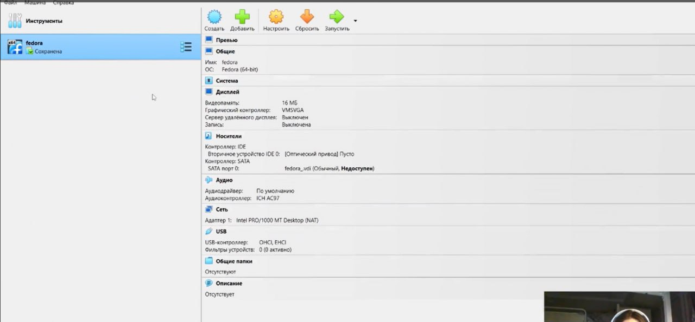{#fig:001 width=70%}

## Дадим имя для новой машины и выберем образ iso

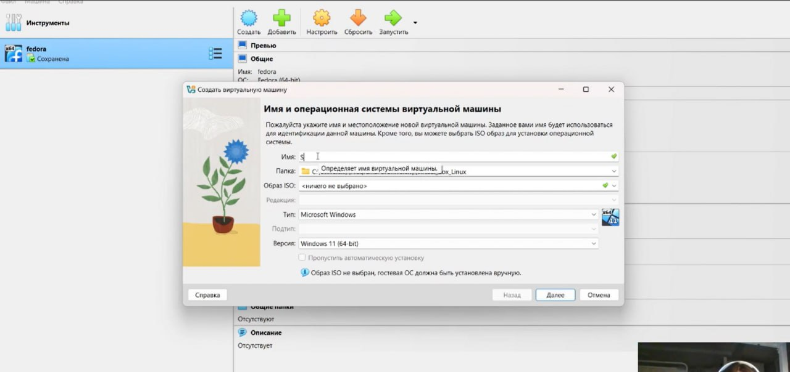{#fig:002 width=70%}

## Выбираем диск для установки

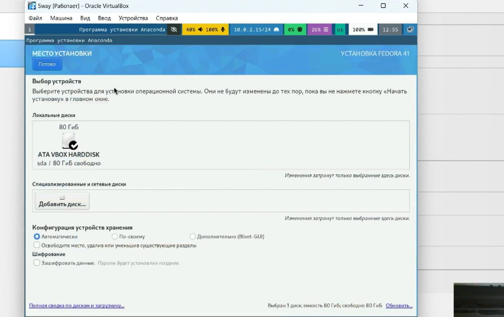{#fig:003 width=70%}

## Установливаем имя и пароль для пользователя root.

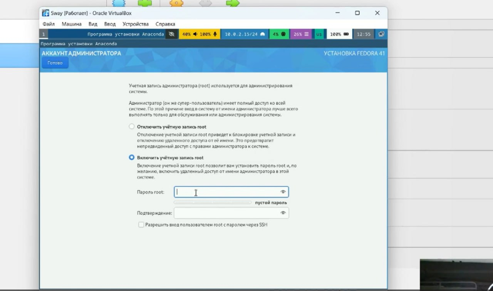{#fig:004 width=70%}

## Устанавливаем имя и пароль для Вашего пользователя.

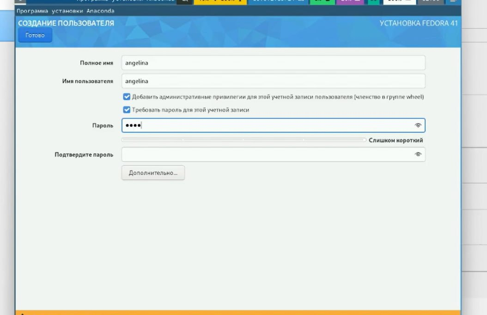{#fig:005 width=70%}

## После завершения установки операционной системы корректно перезапускаем виртуальную машину.

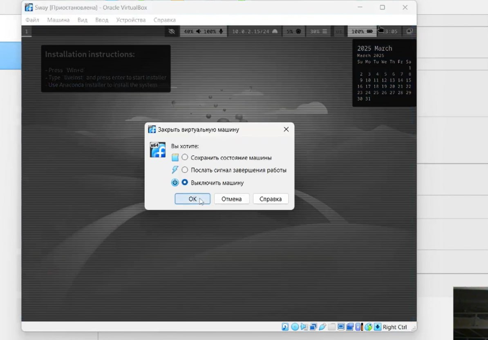{#fig:006 width=70%}

## Отключаем носитель информации с образом.

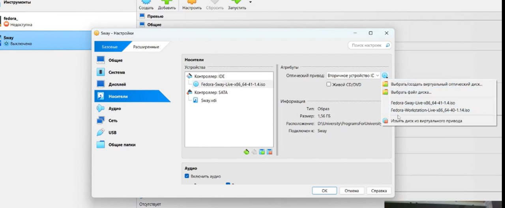{#fig:007 width=70%}

## Входим в ОС под заданной при установке учётной записью.

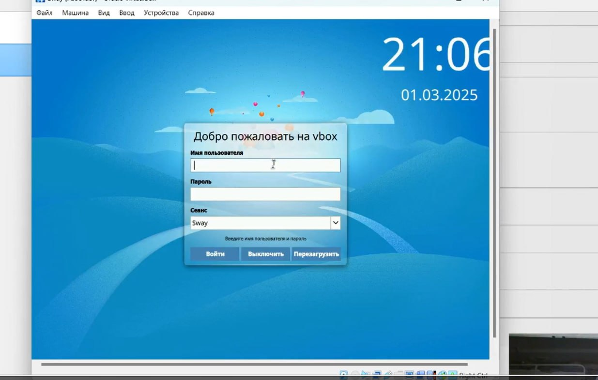{#fig:008 width=70%}

## Переключаемся на роль супер-пользователя.

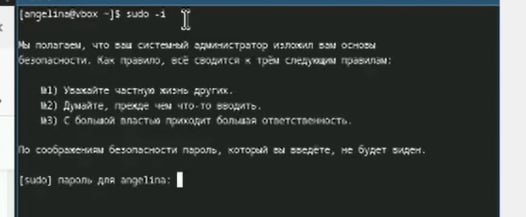{#fig:009 width=70%}

## Далее нам необходимо установить средства разработки

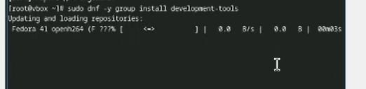{#fig:010 width=70%}

## Теперь выполняем обновление всех пакетов

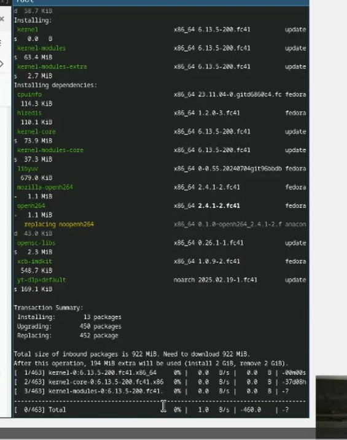{#fig:011 width=70%}

## Устанавливаем программы для удобства работы в консоли

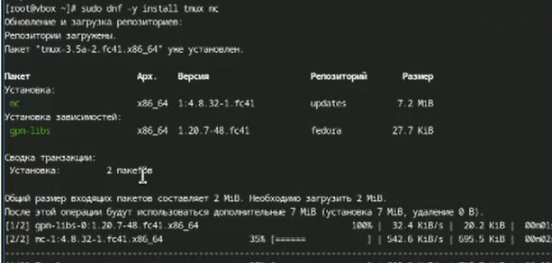{#fig:012 width=70%}

## Используем автоматическое обновление и устанавливаем программное обеспеччение

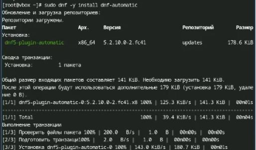{#fig:013 width=70%}

## Запускаем таймер

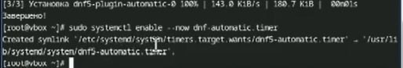{#fig:014 width=70%}

## В данном курсе мы не будем рассматривать работу с системой безопасности SELinux ,поэтому отключим его. В файле /etc/selinux/config заменим значение SELINUX=enforcing на значение SELINUX=permissive

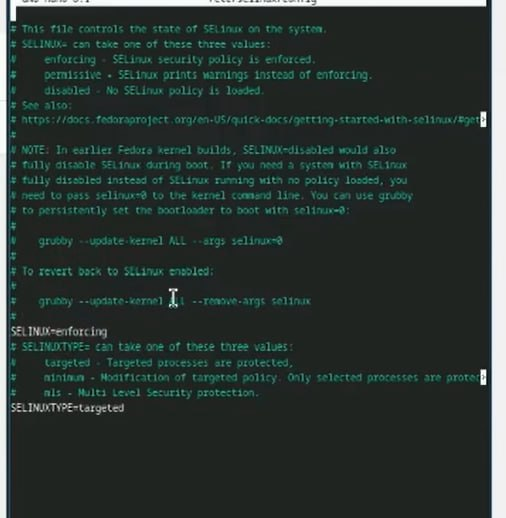{#fig:015 width=70%}

## Переключимся на роль супер-пользователя с помощью sudo -i и отредактируем конфигурационный файл /etc/X11/xorg.conf.d/00-keyboard.conf

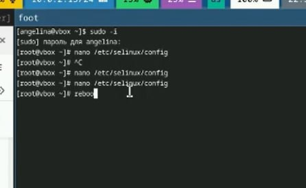{#fig:016 width=70%}

## Запустим терминальный мультиплексор tmux

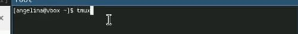{#fig:017 width=70%}

## Создадим конфигурационный файл ~/.config/sway/config.d/95-system-keyboard-config.conf

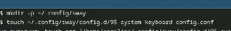{#fig:018 width=70%}

## Отредактируем конфигурационный файл ~/.config/sway/config.d/95-system-keyboard-config.conf

{#fig:019 width=70%}

## Переключимся на роль супер-пользователя с помощью команды sudo -i

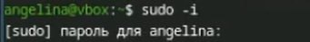{#fig:020 width=70%}

## Отредактируем конфигурационный файл /etc/X11/xorg.conf.d/00-keyboard.conf

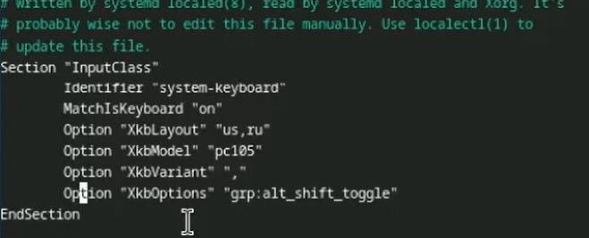{#fig:021 width=70%}

## Установим имя хоста и проверим что всё установилось верно

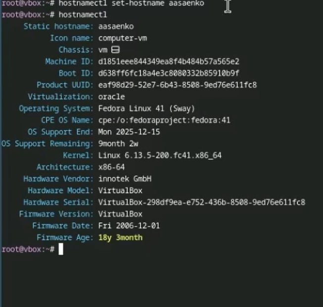{#fig:022 width=70%}

## Переключимся на роль супер-пользователя с помощью команды sudo -i

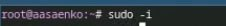{#fig:023 width=70%}

## Установим с помощью менеджера пакетов средство pandoc

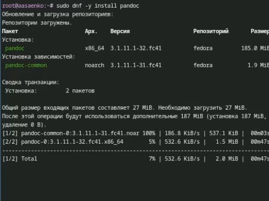{#fig:024 width=70%}

## Пакет pandoc-crossref в стандартном репозитории отсутствует. Придётся ставить вручную,скачав с сайта

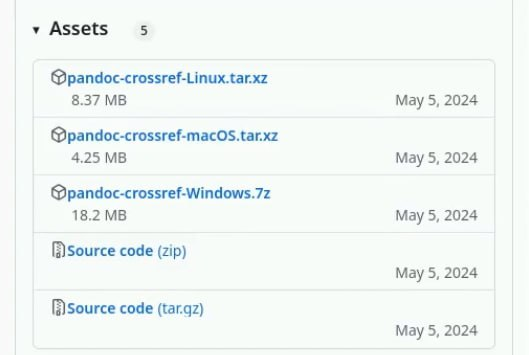{#fig:025 width=70%}

## Проверим верно ли всё установилось

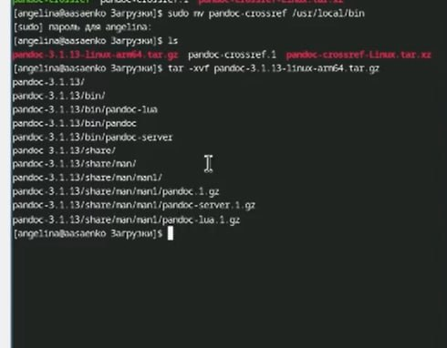{#fig:026 width=70%}

## Установим дистрибутив TeXlive

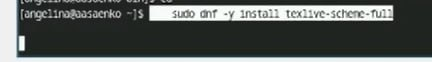{#fig:027 width=70%}

## Выполнение домашнего задания

## Дождёмся загрузки графического окружения и откроем терминал. В окне терминала проанализируем последовательность загрузки системы, выполнив команду dmesg.

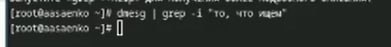{#fig:028 width=70%}

## Версия ядра Linux (Linux version).
## Частота процессора (Detected Mhz processor).
## Модель процессора (CPU0).
## Объём доступной оперативной памяти (Memory available).
## Тип обнаруженного гипервизора (Hypervisor detected).
## Тип файловой системы корневого раздела.
## Последовательность монтирования файловых систем.

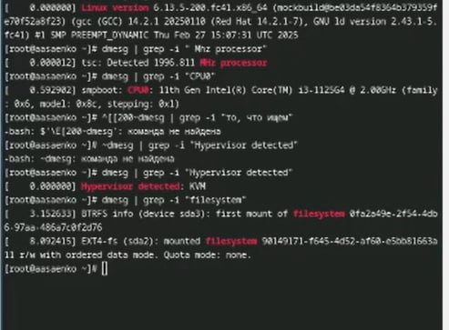{#fig:029 width=70%}

:::

