---
## Front matter
title: "Отчёт по лабораторной работе № 1"
subtitle: "Установка ОС Linux"
author: "Саенко Ангелина Андреевна"

## Generic otions
lang: ru-RU
toc-title: "Содержание"

## Bibliography
bibliography: bib/cite.bib
csl: pandoc/csl/gost-r-7-0-5-2008-numeric.csl

## Pdf output format
toc: true # Table of contents
toc-depth: 2
lof: true # List of figures
lot: true # List of tables
fontsize: 12pt
linestretch: 1.5
papersize: a4
documentclass: scrreprt
## I18n polyglossia
polyglossia-lang:
  name: russian
  options:
	- spelling=modern
	- babelshorthands=true
polyglossia-otherlangs:
  name: english
## I18n babel
babel-lang: russian
babel-otherlangs: english
## Fonts
mainfont: IBM Plex Serif
romanfont: IBM Plex Serif
sansfont: IBM Plex Sans
monofont: IBM Plex Mono
mathfont: STIX Two Math
mainfontoptions: Ligatures=Common,Ligatures=TeX,Scale=0.94
romanfontoptions: Ligatures=Common,Ligatures=TeX,Scale=0.94
sansfontoptions: Ligatures=Common,Ligatures=TeX,Scale=MatchLowercase,Scale=0.94
monofontoptions: Scale=MatchLowercase,Scale=0.94,FakeStretch=0.9
mathfontoptions:
## Biblatex
biblatex: true
biblio-style: "gost-numeric"
biblatexoptions:
  - parentracker=true
  - backend=biber
  - hyperref=auto
  - language=auto
  - autolang=other*
  - citestyle=gost-numeric
## Pandoc-crossref LaTeX customization
figureTitle: "Рис."
tableTitle: "Таблица"
listingTitle: "Листинг"
lofTitle: "Список иллюстраций"
lotTitle: "Список таблиц"
lolTitle: "Листинги"
## Misc options
indent: true
header-includes:
  - \usepackage{indentfirst}
  - \usepackage{float} # keep figures where there are in the text
  - \floatplacement{figure}{H} # keep figures where there are in the text
---

# Цель работы

Приобрести практические навыки установки операционной системы на
виртуальную машину.
# Задание

Установить операционную систему
Сделать настройку раскладки клавиатуры
Установить имя пользователя и названия хоста
Установить программное обеспечение для создания документации

# Выполнение лабораторной работы

Для начала откроем виртуальную машину и настроим её (рис. [-@fig:001]).

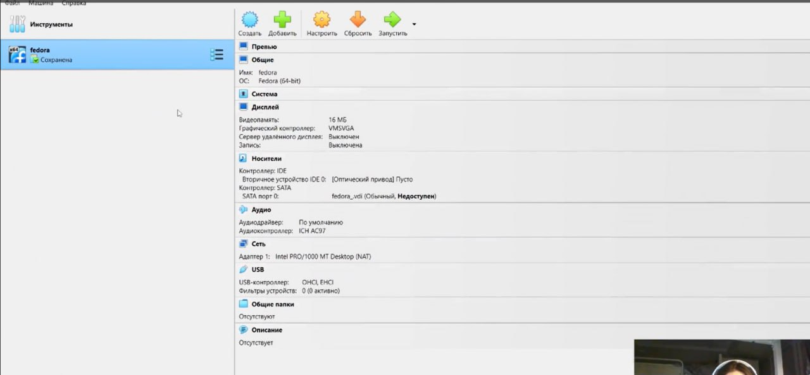{#fig:001 width=70%}

Дадим имя для новой машины и выберем образ iso

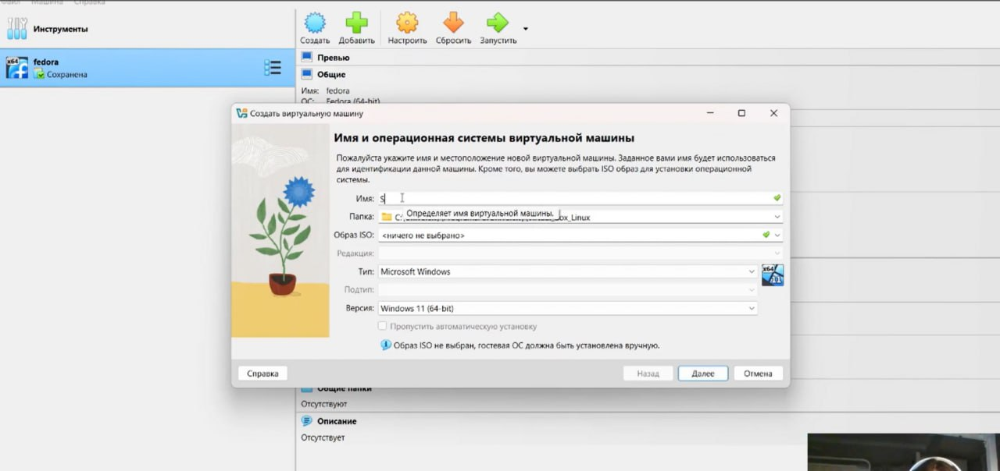{#fig:002 width=70%}

Выбираем диск для установки

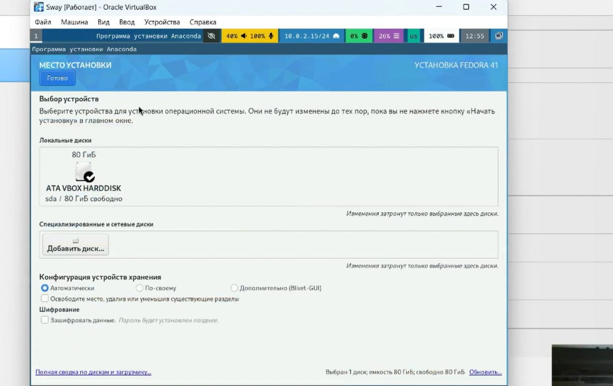{#fig:003 width=70%}

Установливаем имя и пароль для пользователя root.

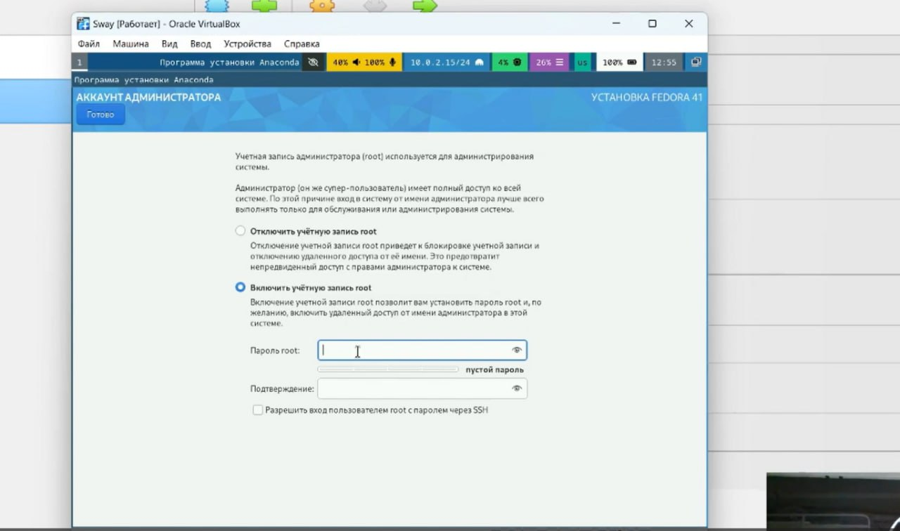{#fig:004 width=70%}

Устанавливаем имя и пароль для Вашего пользователя.

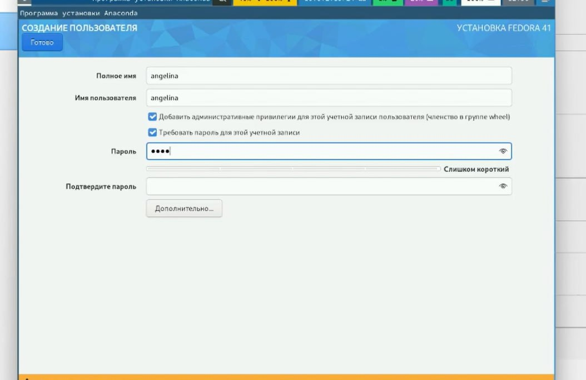{#fig:005 width=70%}

После завершения установки операционной системы корректно перезапускаем
виртуальную машину.

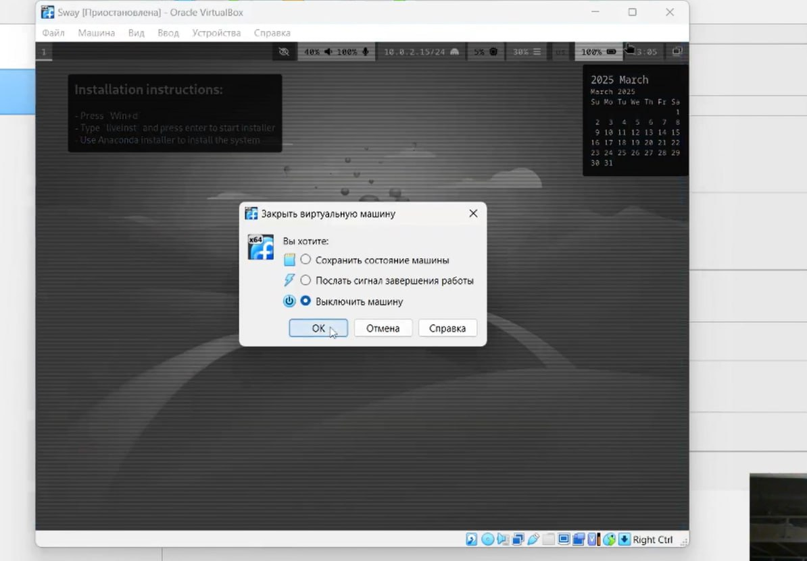{#fig:006 width=70%}

Отключаем носитель информации с образом.

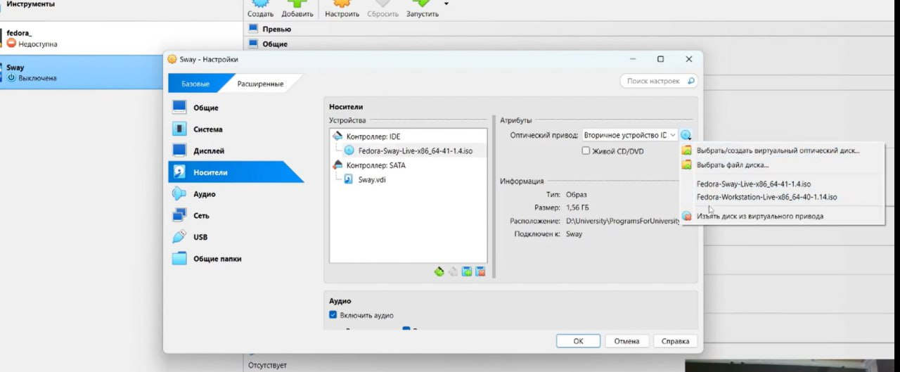{#fig:007 width=70%}

Входим в ОС под заданной при установке учётной записью.

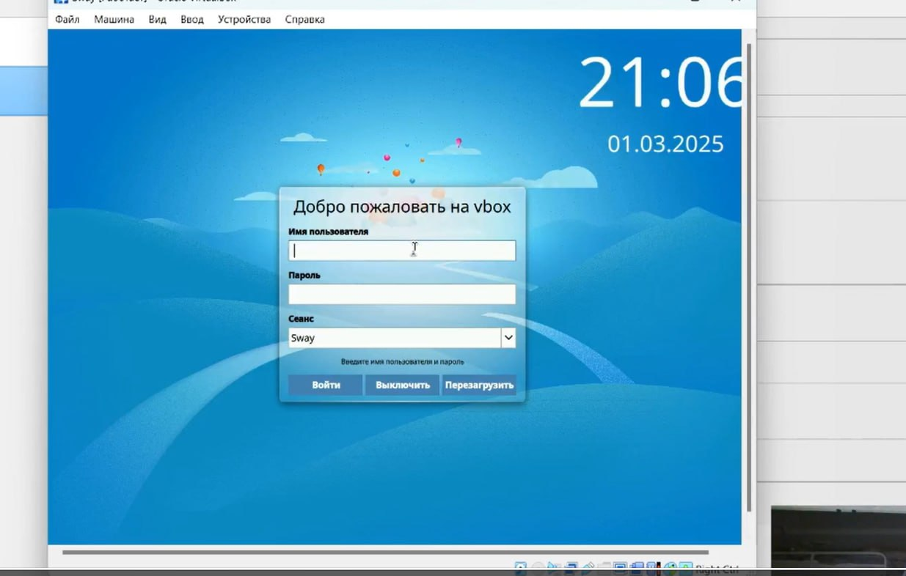{#fig:008 width=70%}

Переключаемся на роль супер-пользователя.

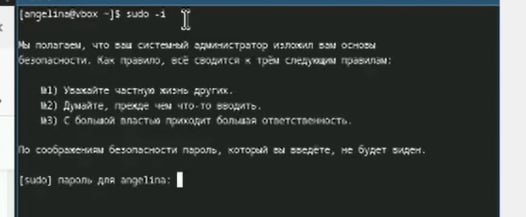{#fig:009 width=70%}

Далее нам необходимо установить средства разработки

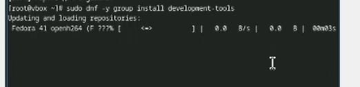{#fig:010 width=70%}

Теперь выполняем обновление всех пакетов

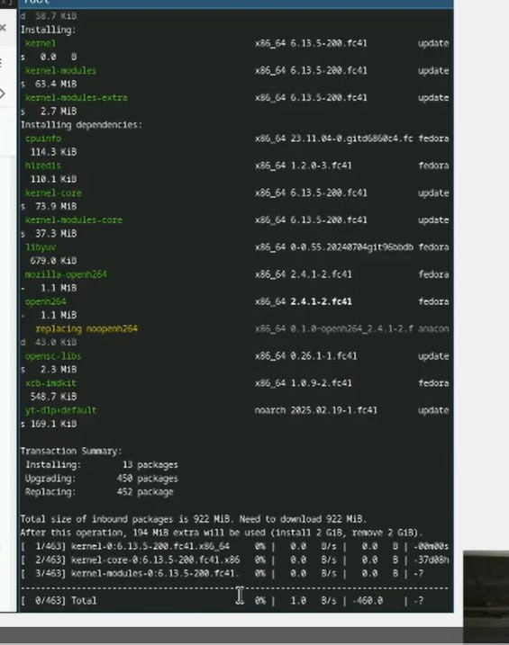{#fig:011 width=70%}

Устанавливаем программы для удобства работы в консоли

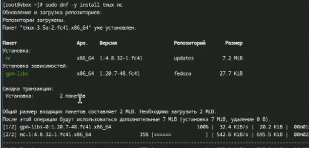{#fig:012 width=70%}

Используем автоматическое обновление и устанавливаем программное обеспеччение

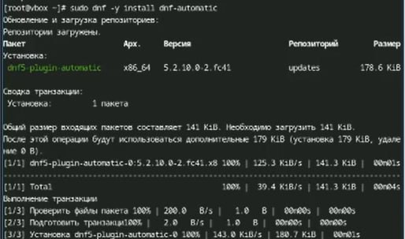{#fig:013 width=70%}

Запускаем таймер

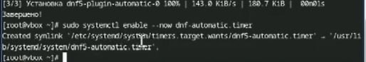{#fig:014 width=70%}

В данном курсе мы не будем рассматривать работу с системой безопасности SELinux ,
поэтому отключим его. В файле /etc/selinux/config заменим значение
SELINUX=enforcing
на значение
SELINUX=permissive

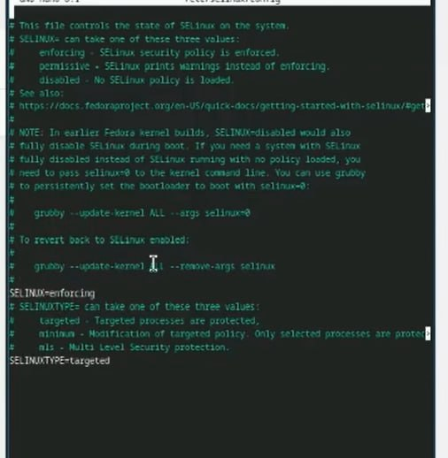{#fig:015 width=70%}

Переключимся на роль супер-пользователя с помощью sudo -i и отредактируем
конфигурационный файл /etc/X11/xorg.conf.d/00-keyboard.conf

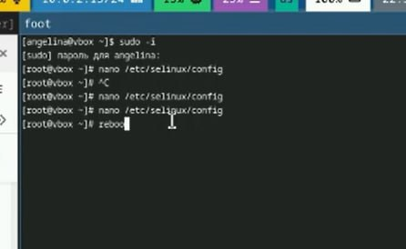{#fig:016 width=70%}

Запустим терминальный мультиплексор tmux

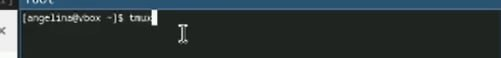{#fig:017 width=70%}

Создадим конфигурационный файл ~/.config/sway/config.d/95-system-keyboard-config.conf

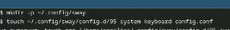{#fig:018 width=70%}

Отредактируем конфигурационный файл ~/.config/sway/config.d/95-system-keyboard-
config.conf

{#fig:019 width=70%}

Переключимся на роль супер-пользователя с помощью команды sudo -i

{#fig:020 width=70%}

Отредактируем конфигурационный файл /etc/X11/xorg.conf.d/00-keyboard.conf

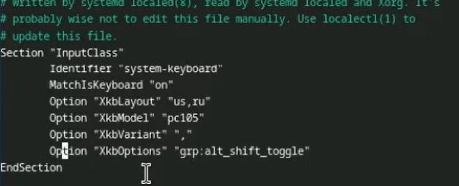{#fig:021 width=70%}

Установим имя хоста и проверим что всё установилось верно

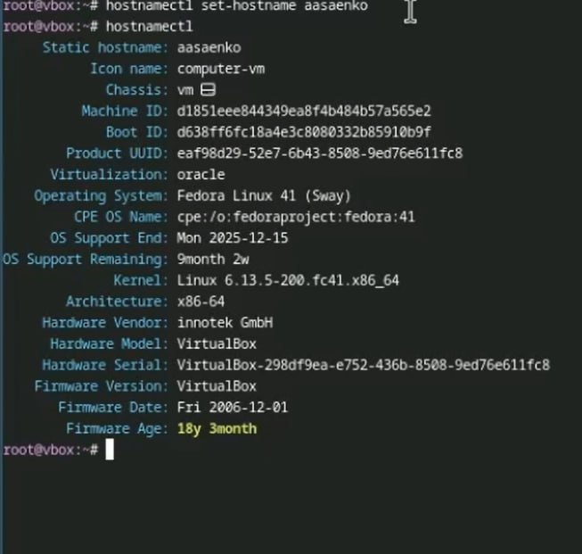{#fig:022 width=70%}

Переключимся на роль супер-пользователя с помощью команды sudo -i

{#fig:023 width=70%}

Установим с помощью менеджера пакетов средство pandoc

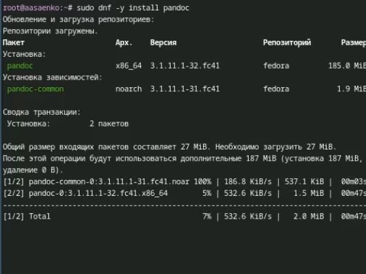{#fig:024 width=70%}

Пакет pandoc-crossref в стандартном репозитории отсутствует. Придётся ставить вручную,
скачав с сайта

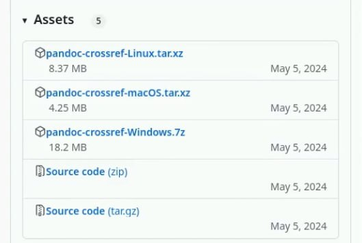{#fig:025 width=70%}

Проверим верно ли всё установилось

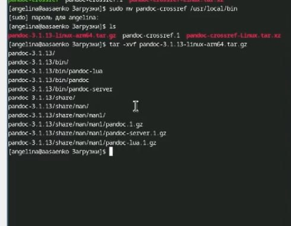{#fig:026 width=70%}

Установим дистрибутив TeXlive

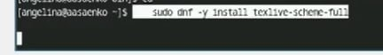{#fig:027 width=70%}

Выполнение домашнего задания
Дождёмся загрузки графического окружения и откроем терминал. В окне терминала
проанализируем последовательность загрузки системы, выполнив команду dmesg.

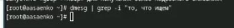{#fig:028 width=70%}

Версия ядра Linux (Linux version).
Частота процессора (Detected Mhz processor).
Модель процессора (CPU0).
Объём доступной оперативной памяти (Memory available).
Тип обнаруженного гипервизора (Hypervisor detected).
Тип файловой системы корневого раздела.
Последовательность монтирования файловых систем.

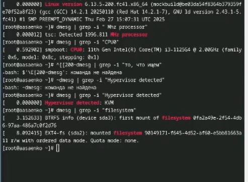{#fig:029 width=70%}

# Выводы

В ходе работы установлена и настроена операционная система на виртуальной машине.
Выполнены задачи по настройке раскладки клавиатуры, установке ПО (Pandoc, TeXlive) и
обновлению пакетов. Проанализирована загрузка системы с помощью dmesg.
Приобретены навыки работы с виртуальными машинами и настройки ОС.

# Список литературы{.unnumbered}

::: {#refs}
:::
