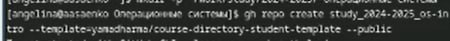

---
## Front matter
lang: ru-RU
title: 
subtitle: 
author:
  - Саенко А.А.
institute:
  - Российский университет дружбы народов, Москва, Россия
  

## i18n babel
babel-lang: russian
babel-otherlangs: english

## Formatting pdf
toc: false
toc-title: Содержание
slide_level: 2
aspectratio: 169
section-titles: true
theme: metropolis
header-includes:
 - \metroset{progressbar=frametitle,sectionpage=progressbar,numbering=fraction}
---

# Информация

## Докладчик

:::::::::::::: {.columns align=center}
::: {.column width="70%"}

  * Саенко Ангелина Андреевна
  * Студент
  * Российский университет дружбы народов

:::
::: {.column width="30%"}

:::
::::::::::::::

# Вводная часть

## Актуальность

Изучение систем контроля версий (VCS) и инструментов, таких как Git, является важным для эффективной разработки программного обеспечения, управления проектами и совместной работы.

## Объект и предмет исследования

Системы контроля версий, в частности Git.
Предмет исследования: Настройка и использование Git для управления версиями проектов.
## Цели и задачи

Цель: Освоить навыки работы с Git, включая настройку, создание ключей, управление репозиториями и выполнение базовых операций.

Задачи:
1. Установить и настроить Git.
2. Создать SSH и PGP ключи.
3. Настроить подписи Git.
4. Зарегистрироваться на GitHub.
5. Создать и настроить локальный репозиторий.

## Материалы и методы

Использование командной строки, инструментов Git и GitHub, создание ключей SSH и PGP, настройка репозиториев и выполнение команд Git (clone, commit, push и др.).

# Создание презентации

## Для начала установим git. В моём случае он уже установлен (рис. [-@fig:001]).

{#fig:001 width=70%}

## Теперь установим gh.

{#fig:002 width=70%}

## Далее, зададим имя для владельца репозитория. В данном случае это моё имя.

{#fig:003 width=70%}

## Теперь зададим почту. Я задала почту, на которую у меня зарегистрирован аккаунт на GitHub.

{#fig:004 width=70%}

## Настроим кодировку utf8 в выводе сообщений git.

{#fig:005 width=70%}

## Зададим имя начальной ветки, настроим параметры autocrlf и safecrlf

{#fig:006 width=70%}

## Создадим ключ RSA размером 4096 бит.

{#fig:007 width=70%}

## Теперь создадим ключ по алгоритму ed25519.

{#fig:008 width=70%}

##Теперь создадим ключ gpg. 
{#fig:009 width=70%}

## Вводим имя и адрес электронной почты.

{#fig:010 width=70%}

## Далее, выводим список pgp ключей .

{#fig:011 width=70%}

## Копируем наш ключ в буфер обмена 

{#fig:012 width=70%}

## Вставляем этот ключ на гитхаб, и задаём ему имя. Я выбрала имя Sway.

{#fig:013 width=70%}

## Теперь производим настройку автоматических подписей

{#fig:014 width=70%}

## После, нам нужно авторизоваться в github с помощью gh.
{#fig:015 width=70%}

## Теперь создаём рабочую директорию курса и переходим в неё 

{#fig:016 width=70%}

## Далее, создаём репозиторий для лабораторных работ из шаблона.

{#fig:017 width=70%}

## И клонируем его к себе на компьютер

{#fig:018 width=70%}

## Переходим в него с помощью cd и удаляем ненужные файлы (package.json) и создаём необходимые каталоги 

{#fig:019 width=70%}

## Теперь добавляем нашу папку для отправки .

{#fig:020 width=70%}

## Делаем коммит ,в котором указываем , что мы сделали структуру курса.

{#fig:021 width=70%}

## И отправляем файлы на сервер GitHub с помощью команды push

{#fig:022 width=70%}

# Выводы

Была произведена установка git , проведена его первоначальная настройка,
были созданы ключи для авторизации и подписи ,а также создан репозиторий
курса из предложенного шаблона .

:::

