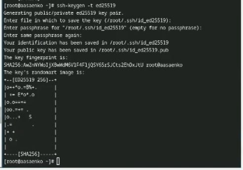
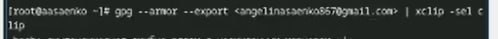

---
## Front matter
title: "Отчёт по лабораторной работе № 2"
subtitle: "ОТЧЁТ"
author: "Саенко Ангелина Андреевна"

## Generic otions
lang: ru-RU
toc-title: "Содержание"

## Bibliography
bibliography: bib/cite.bib
csl: pandoc/csl/gost-r-7-0-5-2008-numeric.csl

## Pdf output format
toc: true # Table of contents
toc-depth: 2
lof: true # List of figures
lot: true # List of tables
fontsize: 12pt
linestretch: 1.5
papersize: a4
documentclass: scrreprt
## I18n polyglossia
polyglossia-lang:
  name: russian
  options:
	- spelling=modern
	- babelshorthands=true
polyglossia-otherlangs:
  name: english
## I18n babel
babel-lang: russian
babel-otherlangs: english
## Fonts
mainfont: IBM Plex Serif
romanfont: IBM Plex Serif
sansfont: IBM Plex Sans
monofont: IBM Plex Mono
mathfont: STIX Two Math
mainfontoptions: Ligatures=Common,Ligatures=TeX,Scale=0.94
romanfontoptions: Ligatures=Common,Ligatures=TeX,Scale=0.94
sansfontoptions: Ligatures=Common,Ligatures=TeX,Scale=MatchLowercase,Scale=0.94
monofontoptions: Scale=MatchLowercase,Scale=0.94,FakeStretch=0.9
mathfontoptions:
## Biblatex
biblatex: true
biblio-style: "gost-numeric"
biblatexoptions:
  - parentracker=true
  - backend=biber
  - hyperref=auto
  - language=auto
  - autolang=other*
  - citestyle=gost-numeric
## Pandoc-crossref LaTeX customization
figureTitle: "Рис."
tableTitle: "Таблица"
listingTitle: "Листинг"
lofTitle: "Список иллюстраций"
lotTitle: "Список таблиц"
lolTitle: "Листинги"
## Misc options
indent: true
header-includes:
  - \usepackage{indentfirst}
  - \usepackage{float} # keep figures where there are in the text
  - \floatplacement{figure}{H} # keep figures where there are in the text
---

# Цель работы

Изучить идеологию и применение средств контроля версий.
Освоить умения по работе с git.

# Задание

Создать базовую конфигурацию для работы с git.  
Создать ключ SSH.  
Создать ключ PGP.  
Настроить подписи git.  
Зарегистрироваться на GitHub.  
Создать локальный каталог для выполнения заданий по предмету.  

# Выполнение лабораторной работы

Для начала установим git. В моём случае он уже установлен (рис. [-@fig:001]).

{#fig:001 width=70%}

 Теперь установим gh.

{#fig:002 width=70%}

Далее, зададим имя для владельца репозитория. В данном случае это моё имя.

{#fig:003 width=70%}

Теперь зададим почту. Я задала почту, на которую у меня зарегистрирован
аккаунт на GitHub.

{#fig:004 width=70%}

Настроим кодировку utf8 в выводе сообщений git.

{#fig:005 width=70%}

Зададим имя начальной ветки, настроим параметры autocrlf и safecrlf

{#fig:006 width=70%}

Создадим ключ RSA размером 4096 бит.

{#fig:007 width=70%}

Теперь создадим ключ по алгоритму ed25519.

{#fig:008 width=70%}

Теперь создадим ключ gpg. Выбираем из предложенных вариантов первый
тип (RSA and RSA), размер ключа задаём 4096 бит и делаем срок действия
ключа неограниченным.

{#fig:009 width=70%}

После нас попросят ввести свои данные. Мы вводим имя и адрес
электронной почты. После этого соглашаемся с генерацией ключа

{#fig:010 width=70%}

Далее, выводим список pgp ключей .

{#fig:011 width=70%}

Копируем наш ключ в буфер обмена 

{#fig:012 width=70%}

Вставляем этот ключ на гитхаб, и задаём ему имя. Я выбрала имя Sway.

{#fig:013 width=70%}

Теперь производим настройку автоматических подписей

{#fig:014 width=70%}

После, нам нужно авторизоваться в github с помощью gh. Мы выбираем сайт
для авторизации (GitHub.com) , после выбираем предпочитаемый протокол
(SSH), публичный SSH ключ (id_rsa.pub) , и имя для ключа (Sway) . В
качестве способа авторизации выбираем авторизацию через браузер .

{#fig:015 width=70%}

Теперь создаём рабочую директорию курса и переходим в неё 

{#fig:016 width=70%}

Далее, создаём репозиторий для лабораторных работ из шаблона.

{#fig:017 width=70%}

И клонируем его к себе на компьютер

{#fig:018 width=70%}

Переходим в него с помощью cd и удаляем ненужные файлы (package.json) и
создаём необходимые каталоги , записав в файл COURSE строку os-intro (это
нам текущий курс) и прописываем make prepare для того , чтобы нужные нам
каталоги создались 

{#fig:019 width=70%}

Теперь добавляем нашу папку для отправки .

{#fig:020 width=70%}

Делаем коммит ,в котором указываем , что мы сделали структуру курса.

{#fig:021 width=70%}

И отправляем файлы на сервер GitHub с помощью команды push

{#fig:022 width=70%}

# Выводы

Была произведена установка git , проведена его первоначальная настройка,
были созданы ключи для авторизации и подписи ,а также создан репозиторий
курса из предложенного шаблона .

# Ответы на контрольные вопросы

1. Системы контроля версий - это системы, в которых мы можем хранить
свои проекты и выкладывать их обновления, контролируя релизы и
каждые внесённые изменения. Эти системы нужны для работы над
проектами, чтобы иметь возможность контролировать версии проектов
и в случае командной работы контролировать изменения, внесённые
всеми участниками. Также, VCS позволяет откатываться на более
ранние версии.
2. Хранилище - репозиторий, в нём хранятся все файлы проекта и все его
версии
commit - внесённые изменения в репозитории
история - это история изменений файлов проекта
рабочая копия - копия, сделанная из версии репозитория, с
которой непосредственно работает сам разработчик
3. Централизованные системы контроля версий имеют
один центральный репозиторий, с которым работают все разработчики.
Примером является СVS , который является уже
устаревшей системой.
В децентрализованных системах же используется множество
репозиториев одного проекта у каждого из разработчиков,
при этом репозитории можно объединять брать из каждого
только то, что нужно. Примером является знакомый нам Git.
4. Создаётся репозиторий, и разрабатывается проект. При
внесении изменений файлы отправляются на сервер.
5. Разработчик клонирует репозиторий к себе на компьютер, и после
внесения изменений выгружает их на сервер в качестве отдельной
версии. После этого разработчики с более высокими правами могут,
например , объединить его версию с текущей
6. . Хранение файлов проекта, а также обеспечение командной работы, и
контроль за версиями проекта
7. git clone - клонирует проект с сервера на компьютер
git commit - добавляет папку для выгрузки на сервер
git push - фиксирует изменения репозитория
git pull - выгружает изменения на сервер
git pull - получить изменения с сервера
git rm - удалить файл
git status - получить статус репозитория
8. С локальным: git commit -am “added files" - создаёт коммит
С удаленным: git push - загрузить данные на удалённый сервер
9. Ветки - это несколько независимых копий проекта, в каждой из
которых ведётся разработка какой-то конкретной функции, при этом
ветки существуют параллельно. Они нужны, когда нужно параллельно
вести разработку нескольких функций, а в конце их можно объединить
в одну.
10. Игнорировать файлы можно, внося их в файл .gitignore. игнорировать
файлы нужно, когда их не нужно добавлять в репозиторий. Например,
это могут быть файлы виртуального окружения (venv).

# Список литературы{.unnumbered}
[@tanenbaum_book_modern-os_ru]
[@robbins_book_bash_en]
[@zarrelli_book_mastering-bash_en]
[@nam_ewhbook_learning-bash_en]
::: 
:::
