---
## Front matter
lang: ru-RU
title: 
subtitle: 
  - Саенко А.А.
institute:
  - Российский университет дружбы народов, Москва, Россия
 
## i18n babel
babel-lang: russian
babel-otherlangs: english

## Formatting pdf
toc: false
toc-title: Содержание
slide_level: 2
aspectratio: 169
section-titles: true
theme: metropolis
header-includes:
 - \metroset{progressbar=frametitle,sectionpage=progressbar,numbering=fraction}
---

# Информация

## Докладчик

:::::::::::::: {.columns align=center}
::: {.column width="70%"}

  * Саенко Ангелина Андреевна
  * Студент
  * Российский университет дружбы народов

:::
::: {.column width="30%"}

:::
::::::::::::::

# Вводная часть

## Актуальность

Освоение инструментов управления версиями и ветками (git-flow, commitizen) необходимо для эффективной разработки и управления проектами, особенно в командной работе.
## Объект и предмет исследования

Объект исследования: Репозитории Git и инструменты для управления версиями и ветками.

Предмет исследования: Настройка и использование git-flow, commitizen и стандартных коммитов для управления проектами.

## Цели и задачи
Цель: Получить навыки работы с git-flow и conventional commits для управления ветками и версиями.

Задачи:
1. Установить и настроить git-flow и commitizen.
2. Создать и настроить репозиторий с поддержкой conventional commits.
3. Выполнить релизы с автоматическим обновлением версий и журналов изменений.

## Материалы и методы

Использование командной строки, инструментов git-flow, commitizen, Node.js, GitHub, создание и управление ветками, выполнение коммитов и релизов.

# Создание презентации
## Для начала установим git-flow из коллекции репозиториев (рис. [-@fig:001]).

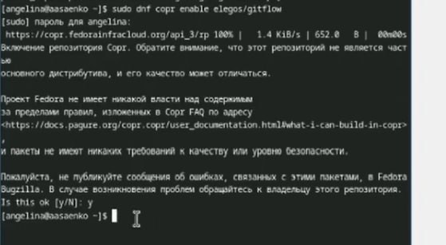{#fig:001 width=70%}

{#fig:002 width=70%}

## На Node.js базируется программное обеспечение для семантического версионирования и общепринятых коммитов. Установим ПО

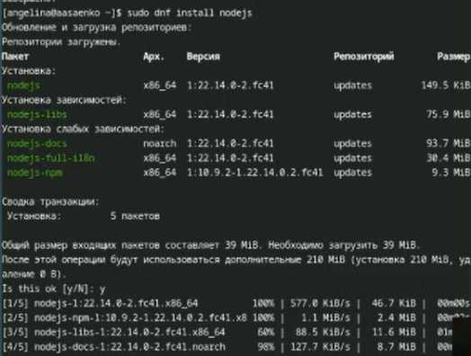{#fig:003 width=70%}

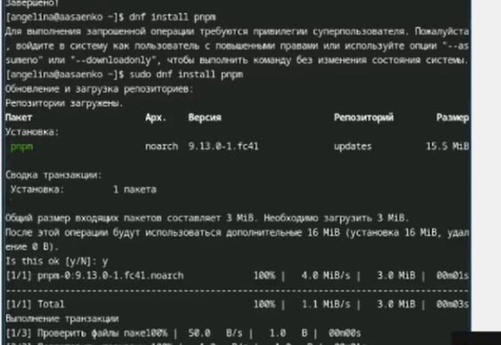{#fig:004 width=70%}

## Для работы с Node.js добавим каталог с исполняемыми файлами, устанавливаемыми yarn, в переменную PATH

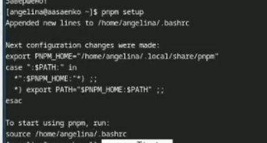{#fig:005 width=70%}

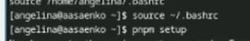{#fig:006 width=70%}

## Данная программа commitizen используется для помощи в форматировании коммитов. При этом устанавливается скрипт git-cz, который мы и будем использовать для коммитов.

{#fig:007 width=70%}

## Создаём репозиторий на GitHub. Для примера назовём его git-extended

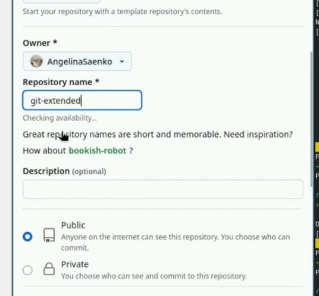{#fig:008 width=70%}

## Делаем первый коммит и выкладываем на github

{#fig:009 width=70%}

{#fig:010 width=70%}

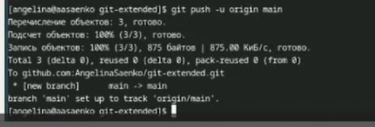{#fig:011 width=70%}

## Далее сделаем конфигурацию для пакетов Node.js

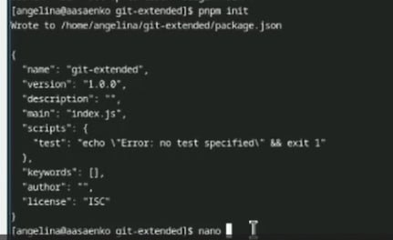{#fig:012 width=70%}

## Необходимо заполнить несколько параметров пакета. Сконфигурим формат коммитов. Для этого добавим в файл package.json команду для формирования коммитов

{#fig:013 width=70%}

## Добавим новые файлы

{#fig:014 width=70%}

## Выполним коммит

{#fig:015 width=70%}

## Выбираем нужное

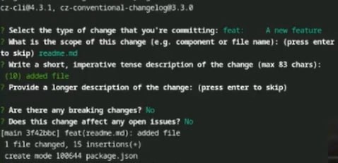{#fig:016 width=70%}

## Отправим на github

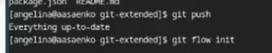{#fig:017 width=70%}

## Инициализируем git-flow

{#fig:018 width=70%}

## Проверим , что мы на ветке develop

{#fig:019 width=70%}

## Загрузим весь репозиторий в хранилище

{#fig:020 width=70%}

## Установим внешнюю ветку как вышестоящую для этой ветки

{#fig:021 width=70%}

## Создадим релиз с версией 1.0.0

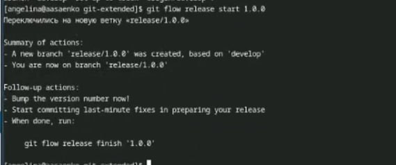{#fig:022 width=70%}

## Создадим журнал изменений

{#fig:023 width=70%}

## Добавим журнал изменений в индекс

{#fig:024 width=70%}

## Зальём релизную ветку в основную ветку

{#fig:025 width=70%}

## Отправим данные на github

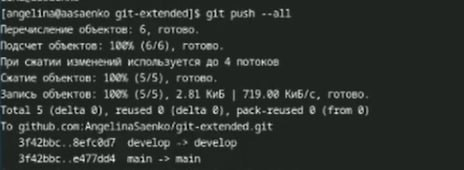{#fig:026 width=70%}

{#fig:027 width=70%}

## Создадим релиз на github. Для этого будем использовать утилиты работы с github

{#fig:028 width=70%}

## Создадим ветку для новой функциональности

{#fig:029 width=70%}

## Далее, продолжаем работу c git как обычно.По окончании разработки новой функциональности следующим шагом следует объединить ветку feature_branch c develop

{#fig:030 width=70%}

## Создадим релиз с версией 1.2.3

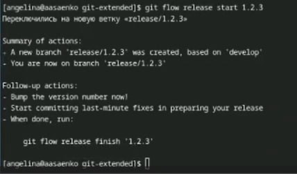{#fig:031 width=70%}

## Обновим номер версии в файле package.json. Установим её в 1.2.3

{#fig:032 width=70%}

## Создадим журнал изменений

{#fig:033 width=70%}

## Добавим журнал изменений в индекс

{#fig:034 width=70%}

## Зальём релизную ветку в основную ветку

{#fig:035 width=70%}

## Отправим данные на github

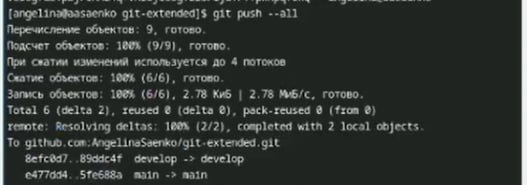{#fig:036 width=70%}

{#fig:037 width=70%}

## Создадим релиз на github с комментарием из журнала изменений

{#fig:038 width=70%}

# Выводы

Освоены инструменты git-flow, commitizen и standard-changelog для управления ветками,
семантического версионирования и оформления коммитов. Настроен репозиторий с
поддержкой общепринятых коммитов, созданы и завершены релизы с автоматическим
обновлением версий и журналов изменений. Получены навыки эффективного управления
разработкой и выпуском проектов.

:::

